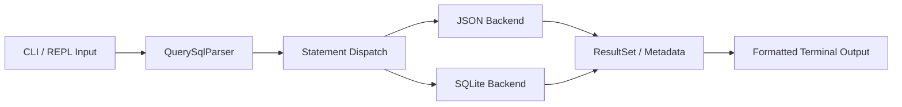

# MySqlClient Portfolio Showcase

## Project Positioning

MySqlClient is a lightweight local SQL engine and data query tool written in C++20. It started as a database learning demo and was rebuilt into a portfolio-ready backend project with:

- a unified CLI entrypoint
- SQL parsing and statement dispatch
- dual JSON and SQLite storage backends
- automated parser, backend, and CLI tests

This project is best presented as a systems-oriented backend project, not as a wrapper around SQLite.

## One-Line Pitch

Built a lightweight SQL query system in C++20 that parses a practical SQL subset, executes statements against JSON and SQLite backends, and validates behavior with end-to-end automated tests.

## Resume Version

### Short Version

- Rebuilt a C++ database demo into a lightweight local SQL engine with JSON and SQLite backends, parser-driven execution, and automated tests.

### Full Version

- Designed and implemented a lightweight local SQL engine in `C++20`, supporting `CREATE`, `SELECT`, `INSERT`, `UPDATE`, and `DELETE` across `JSON` and `SQLite` storage backends.
- Built a unified CLI and REPL workflow with parser-based statement routing, result-set abstractions, and backend-specific execution layers.
- Added automated coverage with `GoogleTest + CTest` for SQL parsing, JSON/SQLite execution, console input handling, and CLI end-to-end flows.

## Architecture Talking Points

### Core Flow



### What To Emphasize

- The parser is not just decorative; CLI execution uses parsed statement type to route behavior.
- JSON and SQLite share the same top-level workflow, but each backend has its own execution strategy.
- The JSON backend behaves like a simple file-backed storage engine, while SQLite demonstrates compatibility with a mature relational backend.
- The project includes both unit-level and end-to-end CLI tests, which makes it stronger as a portfolio piece.

## Demo Script

### Demo Goal

Show that the same CLI can work against two backends with the same mental model.

### JSON Backend Demo

```powershell
bin\Debug\app.exe --backend json --db .\examples\jsondb --execute "SELECT id, name FROM users;"
bin\Debug\app.exe --backend json --db .\examples\portfolio_json --execute "CREATE TABLE users (id INT, name TEXT, age INT);"
bin\Debug\app.exe --backend json --db .\examples\portfolio_json --execute "INSERT INTO users (id, name, age) VALUES (1, 'Alice', 25), (2, 'Bob', 30);"
bin\Debug\app.exe --backend json --db .\examples\portfolio_json --execute "SELECT id, name, age FROM users WHERE age >= 25;"
```

### SQLite Backend Demo

```powershell
bin\Debug\app.exe --backend sqlite --db .\examples\portfolio.db --execute "CREATE TABLE users (id INTEGER PRIMARY KEY, name TEXT, age INTEGER);"
bin\Debug\app.exe --backend sqlite --db .\examples\portfolio.db --execute "INSERT INTO users (name, age) VALUES ('Alice', 25);"
bin\Debug\app.exe --backend sqlite --db .\examples\portfolio.db --execute "INSERT INTO users (name, age) VALUES ('Bob', 30);"
bin\Debug\app.exe --backend sqlite --db .\examples\portfolio.db --execute "SELECT id, name, age FROM users;"
```

### Test Demo

```powershell
ctest --test-dir build -C Debug --output-on-failure
```

## Screenshot Plan

If you want portfolio screenshots, these are the best three:

1. A terminal screenshot showing the JSON backend query result.
2. A terminal screenshot showing the SQLite backend query result.
3. A terminal screenshot of `ctest` passing all suites.

Good framing:

- keep the prompt and command visible
- show the backend flag in the command line
- include at least one table-like query output
- include the passing test summary for credibility

## Interview Talking Points

### Problem

The original codebase was a learning demo with direct SQLite calls, partial abstractions, and incomplete test integration.

### What Was Improved

- replaced the demo-style main program with a real CLI entrypoint
- stabilized the SQL parser around a clear v1 SQL subset
- fixed JSON backend correctness issues such as cursor handling and multi-row writes
- completed the SQLite backend so it could participate in the same product workflow
- rewired test discovery so `ctest` actually validates parser, backend, and CLI behavior

### Tradeoffs

- v1 focuses on correctness and demonstrability over broad SQL compatibility
- JSON and SQLite share the same interface shape, but not full relational parity
- the JSON backend is intentionally simple and file-backed rather than optimized for performance

## Suggested Project Description For A Portfolio Site

MySqlClient is a lightweight SQL execution project built in C++20 that turns a local database learning demo into a more production-style backend system. It provides a unified CLI and REPL, parses a practical SQL subset, and executes queries against both a file-backed JSON engine and a SQLite backend. The project emphasizes correctness, abstraction design, and testability, with automated coverage for parser logic, execution behavior, and end-to-end command-line flows.
